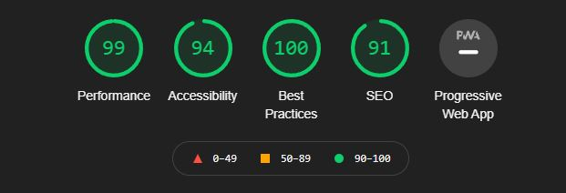

# Movie Quiz
Movie Quiz is a website designed to let users test their knowledge of the cinematic universe. When the users finishes the quiz, they will be presented with a total score in order to compare the results with their friends.

## Contents
1. [Project Goals](#project-goals)
    - [User Goals](#user-goals)
    - [User Stories](#user-stories)
    - [Designer Goals](#designer-goals)
      
2. [Design Choices](#design-choices) 
    - [Fonts](#fonts)
    - [Color Scheme](#color-scheme)

3. [Content](#content)
    - [Start Page](#start-page)
    - [Questions and Answers](#questions-and-answers) 
    - [Results](#results)
    - [Future Goals](#future-goals)

4. [Technologies Used](#technologies-used)
    - [Testing](#testing)
        - [Browsers and Devices](#browsers-and-devices)
        - [Responsiveness](#responsiveness)
    - [Validators](#validators)
        - [HTML](#html)
        - [CSS](#css)
        - [JSHINT](#jshint)   
        - [LightHouse](#lighthouse)
    - [Known Bugs](#known-bugs)

 5. [Deployment](#deployment)

 6. [Credits](#credits)

## Project Goals
The goal was to create a simple, easy to use quiz game for users that want to test their movie knowledge. Whether that's about music composers, directors or the actual content within them.

## User Goals
The quiz is targeted at the broader movie interested audience.

## User Stories
- As a user I want the quiz to be easy to navigate.
- As a user I want clear feedback on my performance.
- As a user I want to be challenged.
  
## Designer Goals
- Simple design with few choises across all devices.
- A flow of information that is clear and easy to understand.
- Satisfactory feedback on user inputs.

## Design Choices
### Fonts
Since the quiz is quite simple in it's design, I felt like there was room for a more relaxed font style. 
Therefore I decided to use 'Slackey' for the logo. To not exaggerate this I decided to use
'Peralta' for my headings as this comes across as a slightly tuned down version of 'Slackey'.  

### Color Scheme
Along with the nature of the fonts I decided to take a more colorful approach on the back & foreground-colors. 
To give contrast to the bright orange buttons and white headings I chose a darker blue for the contents background while the body consists of a lighter beige color in order to
keep the lighthearted feel that the quiz is aimed to represent.

- Game background: #012133
- Buttons: #ff6600
- Heading text: #fff
- Body Background: #eee8aa

## Content
### Header
The header is simple and only consists of a logo to represent the quiz.

### Start Page
The start page contains a button on which you can start the actual quiz.

### Questions and Answers
The Q/A page shows the question in the heading above and questions grouped in two options per line.

### Results
After completion of the quiz the results page will display the users score in comparison to the maximum score. Here, the user will also
be able to replay the quiz through the "Play Again" button.

### Future Goals
- Possible future features would include a bigger and more random selection of questions making it so the game becomes different each time you play.
- Adding a scoreboard to be able to compare yourself to other users.

## Technologies Used
### Languages
- HTML
- CSS
- Javascript

### Libraries 
- Sweet Alerts 2

## Testing
### Browsers and Devices 

I asked my girlfriend to try the quiz out on her Iphone 5 and give me feedback on it and the user experience seemed overall positive.

#### Responsiveness

Testing the application had me try the different screen sizes using the dev tools chrome extension aswell as using different browsers. Responsiveness is present on all screen sizes.

### Validators
  
  #### HTML
  
  
  
  #### CSS
  
  
  
  #### JSHINT
  
  

  #### Lighthouse

  

## Known Bugs
- No knows bugs

## Deployment
#### The site was deployed to GitHub pages
- In github repository, go to settings
- Select master branch as source location.
- Press the provided link
- Site is accessible via [Movie Quiz](https://ksson96.github.io/game-quiz/)
  
## Credits 
- Credit to my girlfriend for helping with testing of the quiz.

